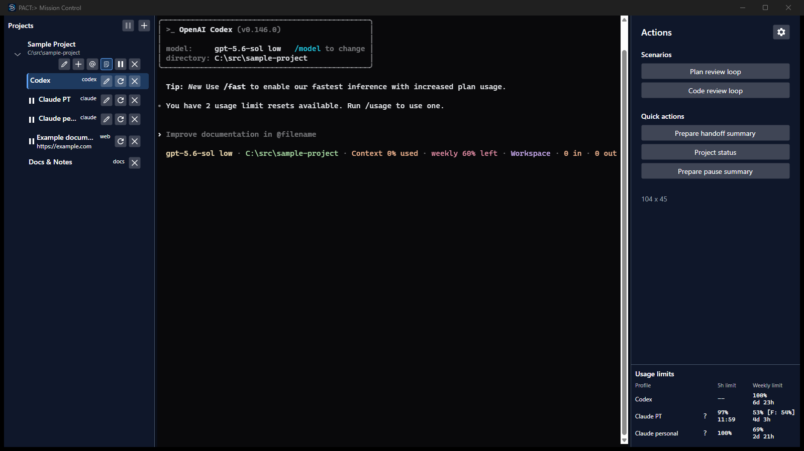
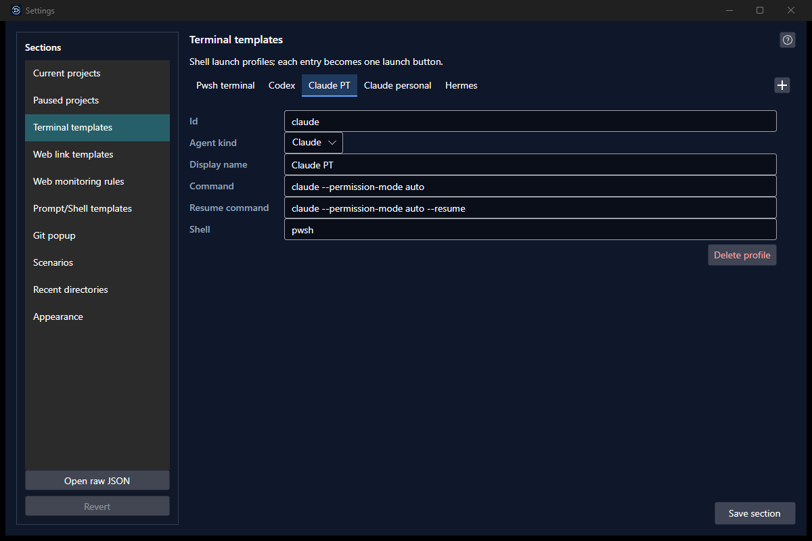

# PACT:> Mission Control

[English](README.md) | [Русский](README.ru.md)

PACT:> Mission Control is a Windows desktop cockpit that keeps coding-agent
terminals, project context, documentation, and operational links visible in
one place.





## What it does

- Runs visible Codex, Claude, Hermes, PowerShell, and custom terminal sessions
  through the bundled Windows ConPTY and xterm.js.
- Keeps live sessions running while you switch between terminals, project
  Markdown, notes, and native WebView2 browser tabs.
- Provides explicit prompt, selection, Git, and fixed author/reviewer scenario
  actions without turning subscription TUI tools into a hidden API.
- Lets agents inside a visible session ask Pact to start a review, read,
  append, or revision-safely replace project Notes, and open a browser tab.
- Provides a pinned Hermes orchestrator that can report on every visible
  agent, control active reviews, inspect running-project Notes and saved web
  tabs, and relay status while the workstation is locked.
- Persists projects and nested sessions under one selectable data root.
- Keeps persistent project-independent ROOT terminal and browser tabs above the
  project tree, with explicit per-tab pause and resume.
- Opens terminal HTTP(S) links as saved browser tabs under the same project or
  ROOT, supports exact custom URLs, and persists drag-and-drop tab ordering.
- Monitors configured loaded web pages while they are hidden.

PACT:> is Windows-only. The supported package is framework-dependent
`win-x64`; there is no cross-platform product head.

## Requirements

To run a release manually from the portable ZIP:

- Windows 11 x64;
- [.NET 10 Runtime x64](https://dotnet.microsoft.com/download/dotnet/10.0);
- [Microsoft Edge WebView2 Runtime](https://developer.microsoft.com/microsoft-edge/webview2/).

The Setup package checks these two runtimes and offers to install a missing
one before PACT. You do not need to install them in advance when using Setup;
an Internet connection is required only when a prerequisite must be downloaded.

Coding-agent CLIs are not bundled. Install each CLI you intend to use and make
its command available on `PATH`; the starter profiles call `codex`, `claude`,
`hermes`, and `pwsh`. The built-in PowerShell profile therefore also requires
PowerShell 7.

Contributors also need the .NET 10 SDK, Node.js 22 or newer, and PowerShell 7.

## Install a release

Download the Setup executable and `SHA256SUMS.txt` from the
[latest release](https://github.com/s-titov-82/pact-mission-control/releases/latest).
Compare Setup's SHA-256 digest before running it:

```powershell
Get-FileHash .\pact-mission-control-0.1.1-win-x64-setup.exe -Algorithm SHA256
```

Run Setup and follow its prompts. It installs PACT for the current user under
`%LOCALAPPDATA%\Programs\Pact Mission Control` by default, but you may choose
another directory. A later interactive Setup remembers that chosen directory.
Setup creates a Start menu shortcut and can optionally create a desktop
shortcut. Installing or uninstalling PACT does not remove the data under
`%APPDATA%\Pact`.
Run a newer Setup to upgrade in place; Setup blocks installing an older version
over a newer one. Close PACT normally before upgrading so live agents are not
terminated while files are replaced.

PACT checks the stable GitHub release channel at startup and then
once per hour. When a newer `vMAJOR.MINOR.PATCH` release is available, PACT
shows its release notes and asks before downloading it. The verified Setup is
staged under the PACT data root. Once no terminal is busy, no review is active,
and shutdown has not begun, PACT offers `Restart and update`. The helper waits
until both PACT and its bundled ConPTY executable are no longer locked, updates
the directory containing the running `Pact.App.Avalonia.exe`, deletes the Setup
package, and relaunches PACT without requesting a Windows reboot.

The update restart restores the tabs that were active immediately before the
handoff, their selection, and unread completion markers. Agent terminals resume
only when both a resume command and an extracted conversation id are available;
other terminals cold-start and are named in the restoration summary. Tabs that
were paused stay paused. A diagnostic `Soft restart and restore active tabs`
action is available under `Settings -> Updates -> Diagnostics` for exercising
the same restoration path without installing an update.

The ZIP remains available as a portable/manual alternative. It requires the
two runtimes listed above to be installed first; extract it to a user-writable
directory and start `Pact.App.Avalonia.exe`.

The first public releases may be unsigned by Authenticode, so Windows
SmartScreen can warn. See [Release verification](docs/release-verification.md)
for checksum, SPDX SBOM, and GitHub attestation checks.

## First run

1. Start PACT from the Start menu (or run `Pact.App.Avalonia.exe` from the ZIP).
2. Click `+` beside `PROJECTS` and select the repository directory.
3. Add a terminal session from the project card, choose a launch profile, and
   start it.

For a general Hermes session, dashboard, or shell that is not tied to a
repository, use the `+` or `@` action in the expanded `ROOT` section. New ROOT
terminals start in the current Windows user's existing profile directory.

PACT:> stores durable settings in `%APPDATA%\Pact` by default. Use an isolated
absolute profile when evaluating the application:

```powershell
.\Pact.App.Avalonia.exe --data-root C:\Pact-Test
```

Only one process can own a data root at a time.

## Pact guidance inside agent sessions

When Pact starts or resumes a Codex or Claude terminal, it preserves the selected
profile command and adds a short, session-scoped instruction pointing to
Pact-owned guidance under `Temp/Retained/PactSkills`. The detailed guidance is
read only when needed; it is not copied into every prompt. With agent control
enabled, supported sessions also receive an ephemeral connection to Pact's
loopback MCP server. Pact does not modify global Codex or Claude configuration.

Saving Settings reloads the live scenario and review-profile catalogs. Existing
connected agents receive an MCP tool-list change notification when the set of
available ids changes, so restarting their terminal is unnecessary. Direct
external edits are observed only after that Settings reload boundary or an
application restart.

## Build from source

```powershell
dotnet tool restore --disable-parallel
dotnet restore Pact.slnx --disable-parallel --locked-mode
dotnet build Pact.slnx --no-restore -m:2 -nr:false -v q -p:BuildInParallel=false
```

Node.js is required by the full terminal-host behavior suite, not by the
released application. This sequence only builds the source tree. See
[Development](docs/development.md) for the complete bounded test matrix,
native Windows gates, packaging validation, and maintainer release procedure.

## Documentation and contributing

- [User guide](docs/guide/en/README.md)
- [Settings reference](docs/help/en/README.md)
- [Documentation index](docs/README.md)
- [Architecture](docs/architecture.md)
- [Contributor workflow](docs/development.md)

## License

PACT:> Mission Control is licensed under the [MIT License](LICENSE).
Bundled and vendored dependencies retain their own terms; see
[THIRD-PARTY-NOTICES.md](THIRD-PARTY-NOTICES.md) and the `licenses` directory.
