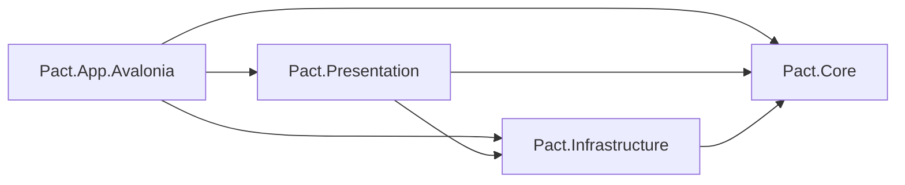

# Architecture

PACT:> Mission Control is a Windows-first Avalonia desktop application for
operating visible coding-agent terminal sessions. Avalonia is the only product
head.

## Dependency direction

- `Pact.Core` contains records, state machines, validation, and other pure
  business rules.
- `Pact.Infrastructure` owns Windows and filesystem integration: ConPTY,
  settings stores, atomic writes, Git processes, and data-root housekeeping.
- `Pact.Presentation` owns UI-neutral orchestration, runtime coordinators, and
  view models.
- `Pact.App.Avalonia` composes the application and adapts Avalonia, native
  WebView2, and Windows UI boundaries.

Dependencies point inward as shown. Core never depends on Presentation,
Infrastructure, or the application head.

## Terminal and WebView boundaries

Each live terminal session owns one `TerminalController`, one bundled ConPTY
backend, and one xterm.js instance. Selecting another session changes which
xterm instance is presented; it does not stop background processes or rebuild
their terminal state. Prompt and scenario actions always target these already
live, user-visible sessions. The application is not a headless API proxy for
subscription TUI tools.

The Avalonia host communicates with the local xterm page through native
WebView2. Browser tabs use separate native WebView2 controllers. Loaded hidden
terminal and browser pages remain operational: the WebView2 environment adds
`--disable-background-timer-throttling`,
`--disable-renderer-backgrounding`, and
`--disable-backgrounding-occluded-windows`. This is deliberate because
background terminal output and web monitoring must continue while another tab
is selected. The tradeoff is higher CPU, memory, and power use than allowing
Chromium to suspend hidden content.

Terminal screen and viewport facts cross into C# as immutable snapshots.
Runtime coordinators serialize mutable session ownership, and UI-facing
projections cross an explicit UI dispatcher. Terminal output is batched before
the WebView boundary; resize requests are serialized and only the newest
request may publish a viewport.

The right panel's selected-tab details are an event-driven projection of those
existing runtime facts. Terminal details use classifier verdict, composer and
content-free structural composer evidence, activity, viewport, lifecycle, and scenario-lock metadata; web details use the
saved resume URL plus the live monitor registration, matched rule, observation,
schedule, navigation, unread, and sanitized failure metadata. The projection
does not expose or persist a raw terminal-screen snapshot. External process
metrics have a separate, default-off Appearance preference. While both that
preference and selected-tab details are visible, the Windows infrastructure
reader samples either the selected live terminal's root PID and descendants or
an already-loaded selected WebView2 host. An in-memory UI monitor converts
cumulative processor time into machine-normalized CPU over two-second samples
and publishes combined working set and process count. WebView2 extended process
information attributes renderers exclusively rooted at the selected main frame
to the page; browser, GPU, utility, and renderers shared across root frames are
reported separately as shared runtime. Renderers belonging only to other tabs
are excluded. Switching away, hiding details, disabling the preference, or
losing the live host/PID stops the corresponding poller. Paused web tabs are
never loaded or resumed for metrics.

See [Bundled ConPTY](adr/0002-bundled-conpty.md) and
[Native WebView2 with xterm.js](adr/0006-native-webview2-and-xterm.md).

## Agent control boundary

Qualified terminal launch profiles receive an ephemeral per-session token and
the loopback-only MCP endpoint address. The token identifies the calling live
session, so notes and browser actions stay under that session's project or
ROOT owner. Tokens are revoked on stop, exit, and restart; endpoint shutdown
stops admission and drains accepted requests before terminal and WebView
resources are disposed.

At startup Pact atomically publishes its short agent guidance as owner-managed,
disposable Markdown under `Temp/Retained/PactSkills`. Launch composition adds a
conditional pointer, never the miniskill bodies, after selecting the direct
process or PowerShell route. Arguments remain structured until that point:
direct launches use Win32 argument quoting, while PowerShell launches use an
encoded script and literal argument array so spaces, dollar signs, backticks,
and other path metacharacters survive unchanged. Claude receives the pointer
through `--append-system-prompt`; Codex receives an invocation-level
`developer_instructions` override. This applies to ordinary, ROOT, reviewer,
restart, and resume launches. When agent control is disabled the pointer names
only the common guidance; when enabled it also names the MCP guidance and the
session receives the endpoint carriers. A publication failure is diagnostic
only: MCP injection continues, but Pact omits pointers to files it did not
confirm as published. Retained Markdown contains no endpoint or credential.

The ordinary endpoint exposes only owner-scoped, UI-equivalent actions:
read/append project Notes, revision-safely replace their complete text, create
a browser tab, and request a file-first review. ROOT callers have no project
Notes. It does not create a headless agent execution path or modify global
Codex or Claude configuration.
`Settings/review-profiles.json` owns reviewer commands; agent-kind launch
argument templates remain code-owned and shared with normal session launch.

The HTTP MCP transport advertises `tools.listChanged=true`. An authenticated
GET opens the server-sent-event notification channel, while JSON-RPC requests
remain authenticated POSTs. Initialize responses issue an opaque
`Mcp-Session-Id` bound to the bearer credential; supplied ids are validated
before routing. Claude's authenticated GET without that session header remains
accepted for client compatibility. After a Settings reload, a change to the
live scenario-id or review-profile-id set publishes
`notifications/tools/list_changed`, allowing connected ordinary sessions to
re-list tools without a terminal restart. There is no settings file watcher,
and display text, commands, ordering, and unrelated settings do not change the
tool catalog. The orchestrator uses a separate fixed catalog and receives no
such notification.

A single pinned Hermes orchestrator tier sits above ROOT. Its durable
credential exposes a separate cross-session MCP catalog for reading workspace,
session, screen, usage, and detailed active-review state, including the current
step, pause state, expected exchange file, and in-memory journal. It can submit
prompts to already-live unlocked sessions and cooperatively request or resume a
review pause.

The orchestrator has no project ownership, but its bounded resource tools can
read/append or revision-safely replace Notes for running projects. It can list
active and paused web tabs under running projects and ROOT, resume a tab in the
background without selecting it, and read an already-active host's live
`documentElement` HTML in bounded UTF-16 fragments. Paused projects are
excluded. There is no orchestrator Git, project Markdown/document, arbitrary
JavaScript, or scenario-start tool. Ordinary session credentials cannot
enumerate or invoke this catalog. The pinned row uses the same selected-terminal
highlight as ordinary terminal rows. Stable terminal screens, extracted last
messages, and review journals are retained in memory only.

## Projects, documents, and storage

`Settings/projects.json` owns project state and nested saved terminal and web
sessions. Project Markdown files remain in their repositories; Pact-owned
notes live under `Settings/Notes`.

`Settings/root-tabs.json` separately owns project-independent terminal and web
tabs, their last selected item, and explicit per-item pause state. ROOT is not a
sentinel project: it has no project close/pause lifecycle, Git panel, documents,
notes, or scenario ownership. Its unpaused terminals may still participate in
manual prompt and selection actions.

`Settings/agent-control.json` owns the fixed loopback endpoint port.
`Settings/orchestrator.json` owns the singular slot, its durable credential,
launch command, lock/unlock prompts, and the two opt-in switches. Provisioning
writes the same endpoint and credential into the dedicated Hermes profile
`.env`; no global Codex or Claude configuration is changed.

`Settings/appearance.json` owns the theme and whether selected-tab details are
shown. The form editor preserves unknown JSON fields so future appearance
options can coexist with older application versions.

Terminal and browser order is persisted inside each owning project or ROOT
record. Reordering never transfers ownership or mixes terminal and browser
groups. Terminal HTTP(S) link activation crosses the terminal host boundary as
a session-scoped event; the shell creates a saved browser page under that
session's existing project or ROOT owner.

Editable documents expose one immutable persistence projection:

- `Clean` — the current buffer is persisted;
- `Dirty` — local changes are waiting to be saved;
- `Saving` — persistence is in progress;
- `Conflict` — disk changed since the local revision;
- `Failed` — the last save failed and local edits remain retryable.

The data root is `%APPDATA%/Pact` unless `--data-root <absolute-path>` is
supplied. It has exactly four top-level directories:

- `Settings` — durable JSON and notes;
- `WebView` — shared WebView2 user data;
- `Logs` — bounded disposable logs;
- `Temp` — session staging and owner-managed disposable snapshots.

The process lease is a named operating-system mutex derived from the normalized
data-root path. No lock file is stored under `Settings` or elsewhere in the
profile.

## Scenario transport

The scenario coordinator owns the single active review slot per project,
including reservations while an agent-requested reviewer terminal is starting.
The shell owns creation and rollback of that terminal; the view model owns
neither lifecycle.

Scenario journals are in memory. Each review-loop step atomically publishes
one immutable task file below
`.pact-reviews/<run>/pass-NNN-<role>-task.md`. The terminal receives only the
short task-path instruction as one bracketed-paste write and then a separate
Enter. A run never writes while the session is busy, holding a question, or
known to contain unsent composer text. Codex and Claude do not expose a reliable
composer-content reading, so only an explicit non-empty verdict from another
profile refuses delivery. A freshly launched
reviewer reaches readiness through one bounded budget covering its first output,
a settle delay, and the folder-trust dialog, which Pact answers with Enter
exactly once. Delivery is confirmed by a new activity cycle, and every submit
begins one. If the composer still holds the trigger, Pact repairs a dropped
submit with Enter alone; it repeats the paste only after the composer remains
empty while the agent is idle.

Bounded application logs retain metadata-only scenario delivery decisions and
transport exceptions so a later retry stall can be reconstructed. Entries name
the run, step, iteration, role, session, attempt, outcome, and whether write or
submit was attempted; they never include prompt, response, status-line, or
terminal-screen text. Identical consecutive delivery outcomes are coalesced.

The response observer starts before delivery and remains active through every
watchdog and pause state. Busy, a detected question, explicit pending input, or
an unexplained write delays delivery; Pact keeps observing the response file and
retries the same idempotent task-path trigger when the terminal becomes safe. A
complete footer-valid response is authoritative: it cancels delivery recovery,
clears either pause kind, re-locks the terminals, and advances the run.

Manual Pause releases every involved terminal and suppresses all new automatic
writes until explicit Resume, but it does not stop response observation. A
response completed during manual Pause therefore clears the pause and continues
without Resume. Watchdog attention releases only the terminal that needs
attention and recovers automatically. Paused runs retain their files; the run
state and journal remain in memory rather than introducing a second durable
state file. The final result and journal are rendered as read-only Markdown
views. Completion, maximum-iteration, abort, and failure states remove only that
run's Pact-owned directory, and startup removes abandoned `.pact-reviews`.
Generic `.reviews` directories are never owned by Pact.

## Lifetime ownership

The application bootstrap owns startup cancellation and the close-during-start
boundary. The shell controller owns terminal/session shutdown; runtime
coordinators own their controllers; dependency injection owns registered
singletons such as web monitoring. Shutdown drains observed event tasks,
aborts scenarios, flushes documents, captures agent resume commands under one
shared deadline, stops session backends, disposes WebViews, and finally
releases the data-root mutex.

## Non-goals

- A cross-platform product head.
- A hidden or headless agent API.
- Durable terminal transcripts or scenario journals.
- Windows Terminal rendering parity.
